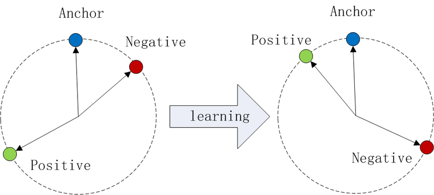

# Speaker Verification via Convolutional Neural Network

Speaker verification is a challenge that determines whether two speech segments were uttered by the same speaker.

This project designs an End-to-End system to decide whether two given utterances belong to the same speaker.

## Speaker Embedding
Speaker embedding is the acoustic features extracted from an utterance. These features are represented in a fixed-length vector of features.

### N-way Classification
Suppose we have M utterances spoken by N unique speakers (M > N), we want to classify every utterance among N classes.

This project use a EmbeddingNet (modified from ResNet in PyTorch) to extract features from utterances. Input a utterance or a part of utterance, the output of EmbeddingNet is the speaker embedding.

We add a linear layer to EmbeddingNet to create a ClassificationNet. Pass the speaker embedding to a linear layer with dimension embedding_dim * num_speakers.  Classify the utterance among the N speakers using softmax function.
Use cross-entropy loss to optimize this EmbeddingNet to predict the correct speakers for utterances.

After the network is trained, remove the linear layer. The left EmbeddingNet can compute the speaker embeddings given arbitrary speech utterances.

## Triplet Loss
Since we want to compute the similarity metric (here we use cosine similarity) between two utterances, we utilize triplet loss to optimize the performance of similarit metric.

Triplet loss takes three inputs, an anchor (an utterance from a specific speaker), a positive example (another utterance from the same speaker) and a negative example (an utterancefrom another speaker). With triplet loss, the cosine similarity between an anchor and the positive example is larger than the cosine similarity between the anchor and the negative example.

We want to find a minimum margin $\alpha$, so that ${s_i}^{ap}- \alpha > {s_i}^{an}$.

## Evaluation
We use Equal Error Rate (EER) metric to evaluate similarity scores. EER is the percentage of pairs at which the false acceptance and false rejection rates are euqated. We want the ERR to be as lo as possible.

From utils.py, we use `ERR(labels, scores)` to compute the ERR and the threshold at which ERR occurs.

## Dataset
### Training set
We have six training chunks, 1, 2, 3, 4, 5, 6. We load training data as features, speakers and nspeakers.

For example, in chunk 1, we have (1202, ) features, (1202, ) speakers, 127 nspeakers. Each feature is an uttreance, which contains an array of frames in different length. Each frame has 64 log mel filters, encoded as 16-bit floating-point numbers. So the dimension of an utterance is (variable utterance length, 64). There are 100 such frames per second of speech.

Although each utterance has variable length of frames, since we are only interested in the speaker information encoded in the utterance instead of the contents, we can choose a fixed number as frame length. If the length of utterance is too short, we wrap around back from beginning. If the utterance is too long, we randomly train the utterance. Notably, this fixed number is learnable. Here we use 14k frames per utterance.

From utils.py, we use `utils.train_load(path, oarts)` to load training data.

### Validation and Test Sets
validation dataset contains (14056, 2) trails, (14056, ) labels, (1065, ) enrollment and (210, ) test utterances.

A trial is a pair of `(enrollment utterance index, test utterance index)`.

The labels are boolean values. For a trail, the label is True iff the two utterances belong to the same speaker.

From utils.py, we use `utils.dev_load(path)` and `utils.test_load(path)` to load the validation and test data.

### Preprocessing
The raw auido contains the segments of slience, which we will remove in the preprocessing step. We use preprocess.py and Vioce Activity Detection (VAD) technique to remive frames if the maximum filter intensity is below some sensible threshold.

